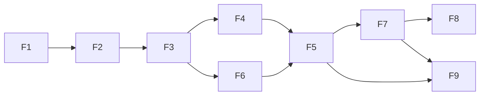

# 02. 기능 명세서

> 기능 단위로 **설명 · 입력 · 출력 · 완료 조건(Acceptance Criteria) · 예외**를 정의한다.
> 완료 조건은 테스트 가능한 형태로 작성한다 — AI/개발자가 "완료" 판단과 테스트 작성의 근거로 삼는다.
> 용어·판정 규칙은 제안서의 동작 예시를, 모듈 간 데이터 구조는 `experiments/tracking/src/core/types.py`를 기준으로 맞춘다.

**우선순위**: `P0`(핵심, 필수) · `P1`(중요) · `P2`(선택/데모)

**기능 의존 관계**

---

## F1. 영상 입력 · 전처리  `P0`
- **설명**: CCTV 영상(파일/스트림)을 프레임 단위로 읽어 모델 입력 형태로 변환하고 fps를 조정한다.
- **입력**: 영상 파일(mp4 등) 또는 RTSP 스트림; 목표 fps; 리사이즈 옵션
- **출력**: 프레임 시퀀스 `{frame_idx, timestamp, image}`
- **완료 조건**
  - [ ] 지정 영상에서 프레임을 순차 추출한다
  - [ ] fps 다운샘플링이 동작한다 (예: 30 → 10fps)
  - [ ] 프레임마다 원본 timestamp가 부여된다 (POS 동기화용)
  - [ ] 영상 끝/스트림 끊김을 정상 종료로 처리한다
- **예외**: 파일 없음/코덱 오류 시 명확한 에러 로그 후 종료

## F2. 객체 탐지 (YOLO)  `P0`
- **설명**: 프레임에서 사람 + 대상 상품 클래스를 탐지한다.
- **입력**: 프레임 이미지
- **출력**: `[{class, bbox, conf}]`
- **완료 조건**
  - [ ] 사람과 상품을 bbox로 탐지한다
  - [ ] `conf_threshold` 이하 탐지는 제거한다
  - [ ] 클래스 목록이 [03_data-spec.md](03_data-spec.md)와 일치한다
  - [ ] 배치/단일 프레임 추론 모두 동작한다
- **예외**: 탐지 0건 프레임도 정상 처리(빈 리스트)

## F3. 다중 객체 추적 (ByteTrack)  `P0`
- **설명**: 사람 detection에 프레임 간 일관된 `track_id`를 부여한다.
- **입력**: 프레임별 사람 detection
- **출력**: `[{track_id, bbox, timestamp}]`
- **완료 조건**
  - [ ] 같은 사람이 프레임이 바뀌어도 동일 `track_id`를 유지한다
  - [ ] 짧은 가림(occlusion) 후 재등장 시 ID를 유지한다(허용 오차 내)
  - [ ] 퇴장 시 track이 종료된다
  - [ ] ID 스위칭 발생률을 측정할 수 있다
- **예외**: 밀집 상황 ID 혼동은 지표로 관리

## F4. 상품 상호작용 이벤트 감지 (TAKE / RETURN)  `P0`
- **설명**: 사람–상품 관계 변화로 TAKE/RETURN 이벤트를 생성한다.
- **입력**: 사람 track + 상품 detection + Zone 정보
- **출력**: 이벤트 `{type: TAKE|RETURN, track_id, product_class, quantity, frame, timestamp}`
- **완료 조건**
  - [ ] SHELF→사람 이동이 `N_take` 프레임 유지되면 TAKE 발생
  - [ ] 사람→SHELF 복귀가 `N_return` 프레임 유지되면 RETURN 발생
  - [ ] 순간 동작은 이벤트로 잡지 않는다(오탐 방지)
  - [ ] 제안서 동작 예시(3개 집음 → 1개 반환 → 1개 결제 → 출구 알림)가 정확히 재현된다
- **예외**: 상품 가림 시 사라짐을 즉시 RETURN으로 보지 않음

## F5. 고객별 보유 상품 상태 관리  `P0`
- **설명**: track별 `held_items`/`paid_items`/`unpaid_count` 상태를 유지·갱신한다.
- **입력**: 이벤트 스트림(TAKE/RETURN/CHECKOUT)
- **출력**: track별 현재 상태 객체
- **완료 조건**
  - [ ] 이벤트 발생 시 상태가 정확히 갱신된다
  - [ ] `unpaid_count = held_count − paid_items` 불변식이 항상 성립한다
  - [ ] `held_count`는 음수가 되지 않는다
  - [ ] 상태 관리 로직에 대한 단위 테스트가 있다
- **비고**: 이 모듈은 영상/모델 라이브러리에 의존하지 않게 순수 로직으로 분리 (테스트 용이)

## F6. POS 결제 이벤트 매칭 (CHECKOUT)  `P0`
- **설명**: 외부 POS 결제 이벤트를 POS Zone 내 track과 매칭해 CHECKOUT을 만든다.
- **입력**: POS 결제 이벤트(JSON) + 현재 track 상태
- **출력**: CHECKOUT 이벤트, 대상 track의 `paid_items` 증가
- **완료 조건**
  - [ ] `T_pos_match` 시간 창 내 POS Zone track과 매칭한다
  - [ ] 매칭 시 `paid_items`가 결제 수량만큼 증가한다
  - [ ] 매칭 실패 케이스가 로그로 남는다
  - [ ] 영상–POS timestamp 동기화가 반영된다
- **예외**: 다중 인원 시 매칭 규칙(TODO)

## F7. 미결제 반출 위험 판정 (EXIT + Risk)  `P0`
- **설명**: 출구 접근 + 미결제 조건으로 HIGH_RISK를 판정하고, 결제되면 하향한다.
- **입력**: track 상태(`unpaid_count`), `zone`
- **출력**: 위험도 `NORMAL | HIGH_RISK`
- **완료 조건**
  - [ ] `unpaid_count>=1 AND zone==EXIT_APPROACH` 시 HIGH_RISK
  - [ ] 이후 CHECKOUT으로 `unpaid_count=0`이면 즉시 NORMAL로 하향
  - [ ] 정상 결제 후 퇴장은 알림이 발생하지 않는다
  - [ ] 판정은 `min_accumulate_frames` 누적으로 확정한다
- **예외**: 순간 진입/이탈은 누적 조건으로 억제

## F8. 알림 출력  `P1`
- **설명**: HIGH_RISK 발생 시 알림을 생성한다.
- **입력**: 위험 판정 결과
- **출력**: 알림 객체(JSON) — 콘솔/파일/화면 오버레이 중 택
- **완료 조건**
  - [ ] HIGH_RISK 시 알림이 1회 발생한다(`alert_cooldown` 중복 억제)
  - [ ] 알림에 `track_id`, `unpaid_count`, `timestamp`가 포함된다
  - [ ] 해제 후 재발생은 허용된다

## F9. 시각화 · 데모  `P2`
- **설명**: 영상 위에 bbox / track_id / 위험도를 오버레이한다.
- **완료 조건**
  - [ ] 영상에 탐지·추적 결과가 표시된다
  - [ ] HIGH_RISK track이 시각적으로 강조된다
  - [ ] 결과 영상 저장 옵션이 있다

---

## 비기능 요구사항 (Non-Functional)

| 항목 | 요구 | 목표(안) |
|---|---|---|
| 실시간성 | 입력 fps를 따라갈 처리 속도 | TODO FPS |
| 정확도 | 미결제 반출 재현율 | TODO |
| 오탐 | 정상 고객 오탐률(핵심) | TODO (낮을수록) |
| 재현성 | 시드 고정·설정 파일로 동일 결과 | 필수 |
| 설정화 | 임계값 하드코딩 금지, `config.yaml` | 필수 |
| 로깅 | 이벤트·매칭 실패·알림 로그 | 필수 |
| 프라이버시 | 얼굴 인식 배제, 임시 ID | 필수 |

---

## 평가 지표

| 지표 | 정의 | 목표(안) |
|---|---|---|
| Recall | 실제 미결제 반출 중 탐지 비율 | TODO |
| False Alarm Rate | 정상 고객을 HIGH_RISK로 오판한 비율 | TODO |
| Precision | HIGH_RISK 알림 중 실제 위험 비율 | TODO |
| FPS | 초당 처리 프레임 | TODO |
| ID Switch | 추적 중 ID 뒤바뀜 횟수 | TODO |

---

## 미확정 항목
- [ ] 비기능 목표 수치(FPS·재현율·오탐률) 확정
- [ ] 알림 출력 채널 확정
- [ ] 평가용 테스트 세트 규모
